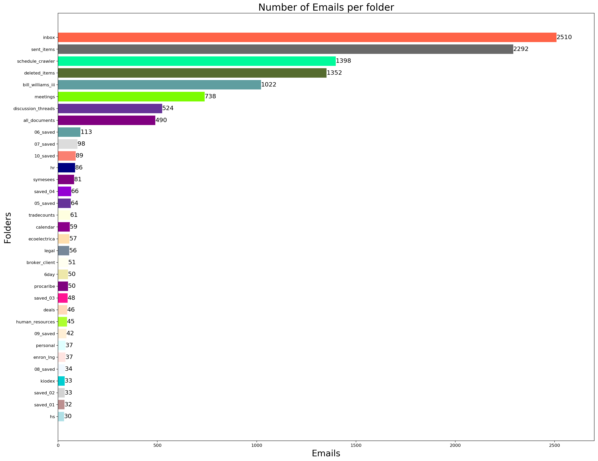
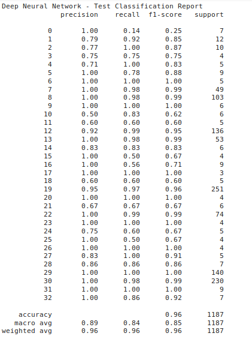

# Convolutional Neural Network to classify the emails of the enron data set (https://www.cs.cmu.edu/~enron/).

The bar graph below displys the number of emails that ara included in every folder. The goal is to train a neural network which classifies the emails into the correct folder. To this end, we split our data into train, validation and test data. The accuracy of our model is 95%. Since the number of emails in the folders is not equally distributed, other accuracy metrics were also used.  

Data set:

Results:

  

